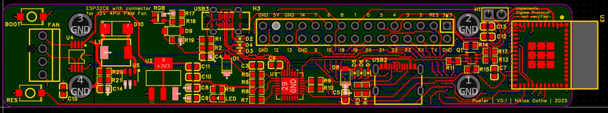

# Puster
## motivation  

I’ve been struggling with a light dust mite allergiy for years, so clean indoor air is more than just a comfort—it’s a necessity. Dust mites thrive in humid environments, and their microscopic waste is causing sneezing, itchy eyes and concentration problems. Since people spend over 90% of their time indoors, where pollutant concentrations can be two to five times higher than outdoors, the quality of indoor air has a huge influence on health (Morantes et al., *Environmental Science & Technology*, 2023; Sensirion, *Improving Indoor Air Quality*, 2023).  

Research shows that three pollutants—particulate matter most (PM2.5 and PM10), formaldehyde, and nitrogen dioxide—account for almost all of the chronic harm caused by typical indoor contaminants. Together they make up nearly 99% of the total health burden, with particulate matter alone responsible for more than 90% of the impact (Morantes et al., 2023). Poor indoor air quality is not only linked to allergies and asthma but also to reduced cognitive performance, sleep disruption, and higher risks of cardiovascular disease (Allen et al., *Environmental Health Perspectives*, 2015; Kang et al., *Building and Environment*, 2023).  

A standard HEPA filter like the one in Puster cannot remove everything, but it is very effective at capturing fine and coarse particles—including PM2.5, PM10, pollen, mold spores, and dust mite debris. This directly addresses the single most harmful category of indoor air pollutants. For the others, different strategies are needed:  

By focusing on HEPA particle filtration, Puster directly reduces the largest share of harm from indoor air pollution, while also lowering exposure to common allergens. Combined with sensible source control and optional add-ons like activated carbon, it offers a practical and flexible way to improve indoor air where it matters most.  

---

### what HEPA filters and what to add for the rest  

| Pollutant | Health effects | HEPA effective? | Remedies / add-ons |
|-----------|----------------|-----------------|---------------------|
| **PM2.5 / PM10** | Major cause of heart & lung disease, >90% of total harm. | ✅ Yes | Run HEPA Puster; boost during spikes (e.g., cooking, smoke); automate with Riecher. |
| **Pollen & dust mites** | Allergy & asthma triggers; mites thrive in humidity. | ✅ Yes | Keep RH ~40–60%; encase bedding; HEPA vacuuming. |
| **Mold spores** | Allergies, asthma, irritation. | ✅ Yes | Fix moisture issues; dehumidify; clean visible mold. |
| **NO₂** | Lung damage, asthma, heart risks. | ❌ No | Use induction/vented cooking; add carbon/chemisorbent filter. |
| **Formaldehyde** | Carcinogen, eye/lung irritant. | ❌ No | Avoid high-emitting materials. |
| **O₃** | Worsens asthma, lung irritation. | ❌ No | Avoid ozone devices; add carbon/MnO₂ media; ventilate when outdoor O₃ is low. |
| **VOCs** | Headaches, irritation; some are carcinogenic. | ❌ No | Source control + ventilation; thick carbon filter, replace often. |
| **Radon** | Second leading cause of lung cancer. | ❌ No | Building mitigation. |
| **CO₂** | Reduces cognition & sleep quality. | ❌ No | Ventilation; demand-control with CO₂ sensor (e.g., Riecher). |

---

**Key references for context:**  
- Morantes, G., Jones, B., Molina, C., & Sherman, M. H. (2023). *Harm from Residential Indoor Air Contaminants*. Environmental Science & Technology, 58(1), 242–257.  
- WHO Guideline for Formaldehyde: 0.1 mg/m³ (80 ppb) over 30 minutes.  
- Allen, J. G., et al. (2015). *Environmental Health Perspectives*. Cognitive decline with poor IAQ.  
- Kang, M., et al. (2023). *Building and Environment*. CO₂ impact on sleep quality.  
- Sensirion (2023). *Improving Indoor Air Quality* brochure.  

## mechanicals
### parts list
- **1x FY0194/30 (for phillips 800 series)**  
  widely available through many different sources 
- **1x ESP32C6 based PCB**  
  More infos/files can be found in /electronics/  
    
- **1x USB-C cable for powering the Puster**  
  this needs to be quite long as it acts as the power cable  
  also used to flash the firmware  
- **1x 4-Pin 12V PWM Fan**  
  i used a noctua fan as they are well built, quite and the color scheme suits my version of Puster  
- **1x base**  
  I routed mine out of reclaimed bankirai wood but you could also print this.  
    
- **1x lid**  
  3D printed out wood-filled-filament but you can use whatever filament you like. Feel free to get creative.:)  
    
- **1x cage**  
  3D printed out wood-filled-filament but you can use whatever filament you like. Feel free to get creative.:)  
    
- **1x adapter**  
  3D printed out wood-filled-filament but you can use whatever filament you like. Feel free to get creative.:)  
    
- **4x rubber feet**  
  these could easily be 3d printed but i used off the shelf parts i had laying around  
  [20mm diameter, 12mm height, 4mm thorugh hole]  
- _x screws
  TODO

### manufacturing

The ***base*** was routed from wood using a cnc machine. This was a dual sided operation as it has features on both sides of the base. On the bottom there is a place for the cable to be routed which acts as a strain relief at the same time. The base is attached to the cage with 4 M4 bolts that also hold the feet in place. I decided against the single responsiblilty idea for simplicity reasons.  

  
The ***cage*** was printed with Bambu Labs wood filament. It just fits on my P1S. On the 0.3mm layer height preset with a 0.6mm nozzle, the print took 12 hours. On my usual preset it would've taken 41 hours.  

  

On my version the print got quite a lot of defects near the top of the print which happended because the vertical slats were unsupported and flexing substantially due to the printing forces. This is mitigated in the current version by added cross braces. Also, the top opening was slightly too small which was also reworked in the second revision. 

  

The ***lid*** was also printed from the same filament. This took just 4 hours.

The ***adapter*** was also printed in this filament for consistency reasons. Here I didnt get around using support structures but with a well tuned preset, they were easily removed.

## electronics
### the pcb 
you can order the pcb through the following link:  
https://aisler.net/p/XLGCRZIT  
i added a stencil to help me with assembly.

the ESP32-C6 was chosen as the core of the Puster PCB because it offers modern wireless connectivity while staying flexible for different smart home ecosystems. with support for Wi-Fi 6, Bluetooth Low Energy 5.0, Zigbee and Thread (Matter), it can easily integrate into existing setups, whether that’s a Zigbee network, Matter-over-Thread, or simple Wi-Fi control. this makes the device adaptable for the future without locking it to one protocol.

for fan control, I used the EMC2101, a dedicated I²C fan controller. this chip simplifies reliable 4-pin PWM fan operation by:  

- generating the Intel-spec compliant PWM signal.
- monitoring the fan tachometer feedback for RPM validation.
- allowing precise control of fan speed directly over the I²C bus.

by offloading the fan PWM and tachometer handling to the EMC2101, the ESP32-C6 remains free for wireless communication and higher-level logic. this approach ensures smooth and safe operation of 12V PC-style fans without risking glitches or timing issues from software-driven PWM and tacho pulse counting.  

I also brought out the full GPIO Header known from the ESP32 Devkits which allows the Puster to be extended to your liking. 

routing turned out to be quite the challenge as the board is only 2cm wide but i managed to somehow squeeze it all in:  
   

### assembly 
TODO - pictures of my assembly process
### testing
TODO -pictures of pcb testing

### the fan
the pcb was built around this type of fan connector(TODO specific kind):  

(from Noctua PWM specifications 
white paper)

*Its important that only 12V fans are used, as other fans might get damaged by being overvolted.*

the pwm lines are driven at 5V, as per intel specification  

## software
## zigbee setup
With the current configuration this device acts as a zigbee router. THat means it will extend your zigbee mesh. I decided to this because I don't have tight power constraints as its plugged into the wall.   

   

 
the Zigbee data model is set up in a way, that the tachometer data (actual fan rpm) can be read from the device over Zigbee and the fan pmw (desired fan rpm) can be set over Zigbee. I haven't tried this yet but you might be able to close the control loop with this.  
TODO. actual cLuster/endpoint architecture

  

### why zigbee?
That decision was simple, i already had a working zigbee mesh network. I've been interested in Matter over Thread lately but thats a story for another time.

*im sure its easily adapted to matter over thread, wifi or whatever other radio protocolls your using in your smarthome*

### pairing
TODO

### resetting
TODO
### flashing custom firmware
TODO - which port to use, links to implementation help/wikis
If anyone adapts this to other protocolls, feel free to share it so other people can benfit too

